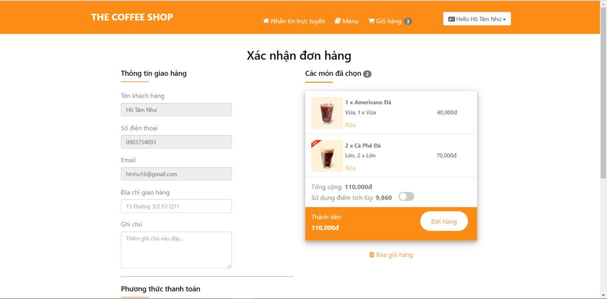

# DoUongOnline

This is a simple web application for an online beverage store, developed as a student group project. The application allows users to browse beverages, add them to a cart, and place orders. It was built using ASP.NET MVC with a SQL Server database, following the Entity Framework Database First approach. Since this is a student project, it does not follow specific design patterns or architectural structures.

---

## Table of Contents

- [Features](#features)
- [Tech Stack](#tech-stack)
- [Database](#database)
- [Setup](#setup)
- [Usage](#usage)
- [Screenshots](#screenshots)
- [License](#license)

---

## Features

- Browse a list of beverages (name, price, description).
- Add beverages to a shopping cart.
- Place an order with basic user information (name, address, phone).
- Admin panel to manage beverages (add, edit, delete).
- Basic user authentication (login/register for customers and admin).

---

## Tech Stack

| Component | Technology |
|-----------|------------|
| Framework | ASP.NET MVC (.NET Framework) |
| Database  | SQL Server |
| ORM       | Entity Framework (Database First) |
| Frontend  | HTML, CSS, JavaScript, Bootstrap |
| IDE       | Visual Studio |

---

## Database

The project uses a SQL Server database with the following main tables:
- **Beverages**: Stores beverage details (ID, Name, Price, Description, Stock).
- **Users**: Stores user information (ID, Username, Password, Role).
- **Orders**: Stores order details (ID, UserID, TotalAmount, OrderDate).
- **OrderDetails**: Stores items in each order (OrderID, BeverageID, Quantity).
- **Cart**: Stores items in the user's cart (UserID, BeverageID, Quantity).

> **Note**: The database schema is simple and was created manually in SQL Server before generating the Entity Framework models.

---

## Usage

1. **Home Page**:
   - Browse the list of available beverages.
   - Click on a beverage to view details.
2. **User Actions**:
   - Register or log in to add items to your cart.
   - Add beverages to your cart and proceed to checkout.
   - Enter your details to place an order.
3. **Admin Actions**:
   - Log in with an admin account (e.g., username: `admin`, password: `admin123`).
   - Access the admin panel to manage beverages (add, edit, delete).

---

## Screenshots

### Item Page 

### Shopping Cart

### Filter

### Checkout Page

### Admin Panel - Manage Beverages

---